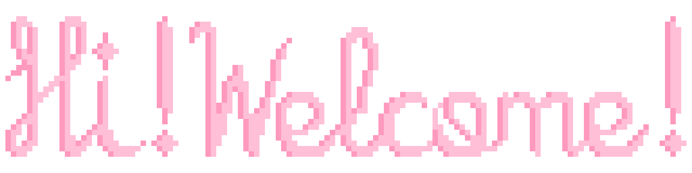

                                                          
## About me!

I'm a junior full-stack web developer, currently in my final year of a BSc in Multimedia and Communication Technologies. I love bringing creative projects to life, and coding is my favorite way to do it. There's nothing like building something from design all the way to functionality. I also have some experience making digital games, which is pretty cool.
Whether it's pixel art, aesthetically pleasing UI, background music, game OSTs, or complex code-based solutions, I put a piece of my passions into every project I create. <3

## Skillset

<table><tr><td valign="top" width="50%">
  
### Languages  
<a href="https://github.com/tsukkiprysm">

  
        

</a>

</td><td valign="top" width="50%">        
  
### Softwares
<a href="https://github.com/tsukkiprysm">

        

</a>
